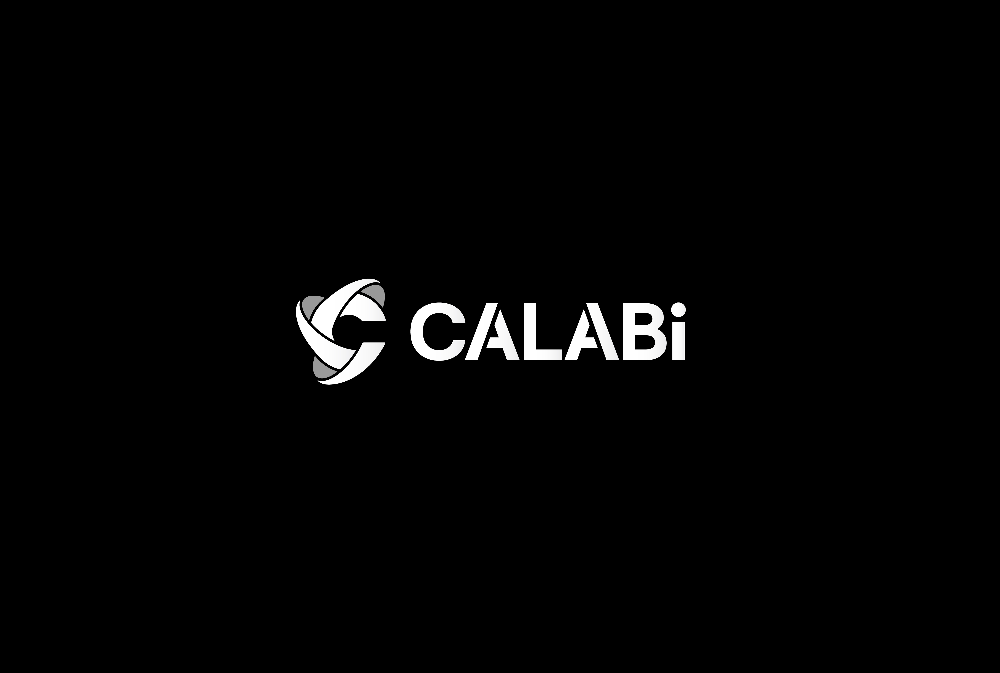

# RTSM — Real-Time Spatio-Semantic Memory

**Object-centric queryable memory for spatial AI and robotics.**

RTSM builds a persistent, searchable memory of objects in 3D space from RGB-D camera streams. Ask natural language queries like *"Where is the red mug?"* and get answers grounded in real-world coordinates.

<!-- TODO: Replace with your YouTube demo link -->
> **[Watch Demo Video](https://youtu.be/abhXsbvOLQg)**

---

## What It Does

- **Real-time segmentation** — FastSAM extracts object instances from each frame
- **Semantic embeddings** — CLIP encodes visual features for natural language queries
- **Persistent memory** — Objects are tracked across views, fused, and promoted to long-term memory
- **Spatial indexing** — Fast proximity queries via 3D grid + vector search (FAISS)
- **Queryable** — REST API and semantic search: find objects by description

```
"Where is the red backpack?" → { id: "a3f2c1", xyz: [1.2, 0.4, 2.1], confidence: 0.87 }
```

---

## Architecture

```
┌──────────────────────────────────────────────────────────────────────────┐
│                 RTSM — Real-Time Spatio-Semantic Memory                  │
└──────────────────────────────────────────────────────────────────────────┘

                            ┌──────────────────┐
                            │   RGB-D Sensor   │
                            │   + SLAM (Pose)  │
                            └────────┬─────────┘
                                     │ ZeroMQ
                                     ▼
┌──────────────────────────────────────────────────────────────────────────┐
│  I/O Layer                                                               │
│                                                                          │
│  ┌─────────────┐     ┌─────────────┐     ┌──────────────┐                │
│  │ ZMQ Bridge  │────>│ IngestQueue │────>│ FramePacket  │                │
│  │  (sensors)  │     │  (buffer)   │     │ (RGB,D,Pose) │                │
│  └─────────────┘     └─────────────┘     └──────┬───────┘                │
│                                                 │                        │
└─────────────────────────────────────────────────┼────────────────────────┘
                                                  │
                            ┌─────────────────────▼───────────────────────┐
                            │              Ingest Gate                    │
                            │   (keyframe priority, sweep-based skip)     │
                            └─────────────────────┬───────────────────────┘
                                                  │
┌─────────────────────────────────────────────────▼────────────────────────┐
│  Perception Pipeline                                                     │
│                                                                          │
│  ┌────────────┐     ┌───────────────┐     ┌──────────────┐               │
│  │  FastSAM   │────>│ Mask Staging  │────>│ Top-K Select │               │
│  │ (segment)  │     │ (heuristics)  │     │  (priority)  │               │
│  └────────────┘     └───────────────┘     └──────┬───────┘               │
│                                                  │                       │
│                     ┌───────────────┐     ┌──────▼───────┐               │
│                     │ Vocab Classify│<────│ CLIP Encode  │               │
│                     │ (label + conf)│     │(224x224 crop)│               │
│                     └───────┬───────┘     └──────────────┘               │
│                             │                                            │
└─────────────────────────────┼────────────────────────────────────────────┘
                              │
                              ▼
┌──────────────────────────────────────────────────────────────────────────┐
│  Association                                                             │
│                                                                          │
│  ┌─────────────┐     ┌─────────────┐     ┌───────────────┐               │
│  │  Proximity  │────>│  Embedding  │────>│  Score Fusion │               │
│  │   Query     │     │  Cosine Sim │     │ (match/create)│               │
│  └─────────────┘     └─────────────┘     └───────────────┘               │
│                                                                          │
└───────────────┬──────────────────────────────────────────────────────────┘
                │
                ▼
┌──────────────────────────────────────────────────────────────────────────┐
│  Working Memory                                                          │
│                                                                          │
│  ObjectState:                                                            │
│    - id, xyz_world (3D position)                                         │
│    - emb_mean, emb_gallery (CLIP embeddings)                             │
│    - view_bins (multi-view fusion)                                       │
│    - label_scores (EWMA label confidence)                                │
│    - stability, hits, confirmed                                          │
│    - image_crops (JPEG snapshots)                                        │
│                                                                          │
│  Proto -> Confirmed (hits >= 2, stability >= 0.5, views >= 2)            │
│                                                                          │
└───────────────┬──────────────────────────────────────────────────────────┘
                │
                ▼
┌──────────────────────────────────────────────────────────────────────────┐
│  Long-Term Memory (FAISS / Milvus)                                       │
│                                                                          │
│  Semantic Search: query(text) -> CLIP -> top-k objects                   │
│                                                                          │
└───────────────┬──────────────────────────────────────────────────────────┘
                │
                ▼
┌──────────────────────────────────────────────────────────────────────────┐
│  API & Visualization                                                     │
│                                                                          │
│  ┌─────────────────┐  ┌─────────────────┐  ┌─────────────────┐           │
│  │    REST API     │  │    WebSocket    │  │     3D Demo     │           │
│  │    /objects     │  │  point clouds   │  │    (Three.js)   │           │
│  │    /search      │  │  objects_update │  │                 │           │
│  └─────────────────┘  └─────────────────┘  └─────────────────┘           │
│                                                                          │
└──────────────────────────────────────────────────────────────────────────┘
```

---

## Quick Start

### Prerequisites

- Python 3.10+
- CUDA-capable GPU (tested on RTX 3080)
- RGB-D camera (Intel RealSense D435i tested)
- SLAM system providing poses (RTABMap, ORB-SLAM3)

### Installation

```bash
git clone https://github.com/your-org/rtsm.git
cd rtsm
pip install -e .
```

### Download Models

```bash
# FastSAM weights
mkdir -p model_store/fastsam
# Download FastSAM-x.pt to model_store/fastsam/

# CLIP weights (auto-downloaded on first run)
python scripts/fetch_clip.py
```

### Run

```bash
# Start RTSM (expects RGB-D + pose stream via ZeroMQ)
python -m rtsm.run
```

RTSM will start:
- **Perception pipeline** — processing frames
- **REST API** — `http://localhost:8000`
- **Visualization WebSocket** — `ws://localhost:8081`

### API Examples

```bash
# List all objects
curl http://localhost:8000/objects

# Semantic search
curl "http://localhost:8000/search/semantic?query=red%20mug&top_k=5"

# Get system stats
curl http://localhost:8000/stats/detailed
```

---

## Configuration

See [`config/rtsm.yaml`](config/rtsm.yaml) for full configuration options:

- **Camera intrinsics** — focal length, resolution
- **I/O endpoints** — ZeroMQ addresses for camera and SLAM
- **Pipeline tuning** — mask filtering, association thresholds
- **Memory settings** — object promotion, expiry, vector store

---

## Project Structure

```
rtsm/
├── core/           # Pipeline, association, data models
├── models/         # FastSAM, CLIP adapters
├── stores/         # Working memory, proximity index, vector stores
├── io/             # ZeroMQ ingestion, frame buffering
├── api/            # REST API server
├── visualization/  # WebSocket server, 3D demo
└── utils/          # Helpers, transforms
```

---

## Performance

*Benchmarks on RTX 5090 (your mileage may vary):*

| Stage | Metric |
|-------|--------|
| Input throttling | 30 Hz raw → 5–7 Hz processed (keyframe gating) |
| Mask filtering | Heuristic filter rejects 10–1500% area masks as insignificant |
| Proto-object yield | >90% of static object masks successfully accumulate via associator |
| Frame latency | <30 ms end-to-end (FastSAM + CLIP stack) |
| LTM upsert rate | 5 s default interval |

---

## Roadmap

- [ ] ROS 2 integration
- [ ] Multi-camera support
- [ ] Improved temporal consistency
- [ ] LLM integration for high-level queries

---

## Acknowledgments

RTSM builds on excellent open-source work:

- **FastSAM** — Zhao et al., *Fast Segment Anything*, 2023.
  [arXiv:2306.12156](https://arxiv.org/abs/2306.12156) · [GitHub](https://github.com/CASIA-IVA-Lab/FastSAM)

- **CLIP** — Radford et al., *Learning Transferable Visual Models From Natural Language Supervision*, 2021.
  [arXiv:2103.00020](https://arxiv.org/abs/2103.00020) · [GitHub](https://github.com/openai/CLIP)

- **RTAB-Map** — Labbé & Michaud, *RTAB-Map as an Open-Source Lidar and Visual SLAM Library for Large-Scale and Long-Term Online Operation*, Journal of Field Robotics, 2019.
  [Paper](https://doi.org/10.1002/rob.21831) · [GitHub](https://github.com/introlab/rtabmap)

---

## Community

This project is under active development. If you have questions or run into issues, feel free to open an issue — I'm happy to help.

If you find RTSM useful, please consider giving it a star! I'm also looking for design partners — reach out to [Calabi](https://github.com/calabi-team) if you're interested in collaborating.

---

## License

Apache-2.0

---

## Author

Built by [Chi Feng, Chang](https://github.com/vipipi)
